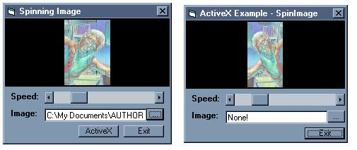



## Spinning Image Effect \(w/ ActiveX Control\)

### Description

this is pretty simple... i took the effect from my other project and put it into a activex control so you can put it in ur app... with a few more options like now you can have color background or a picture background... if you use it please give me credit and please vote!
 
### More Info
 

             |
---                |---
**Submitted On**   |2002-06-25 02:04:04
**By**             |[poop\_4\_brains](https://github.com/Planet-Source-Code/PSCIndex/blob/master/ByAuthor/poop-4-brains.md)
**Level**          |Beginner
**User Rating**    |5.0 (20 globes from 4 users)
**Compatibility**  |VB 6\.0
**Category**       |[Coding Standards](https://github.com/Planet-Source-Code/PSCIndex/blob/master/ByCategory/coding-standards__1-43.md)
**World**          |[Visual Basic](https://github.com/Planet-Source-Code/PSCIndex/blob/master/ByWorld/visual-basic.md)
**Archive File**   |[Spinning\_I984046252002\.zip](https://github.com/Planet-Source-Code/poop-4-brains-spinning-image-effect-w-activex-control__1-36238/archive/master.zip)

